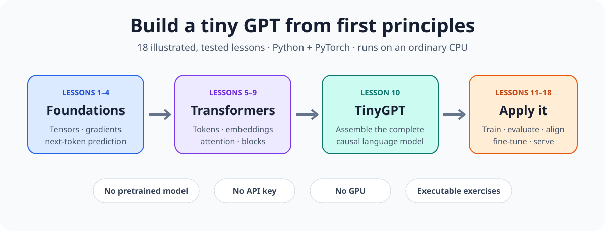
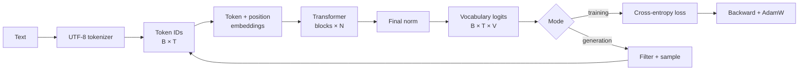
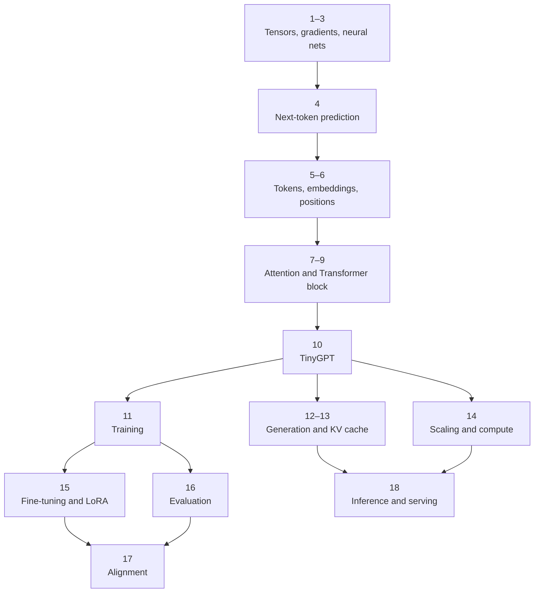

# LLM Lessons

<a href="https://github.com/lhmily/llm-lessons/actions/workflows/ci.yml"></a>
<a href="https://www.python.org/"></a>
<a href="https://pytorch.org/"></a>
<a href="#curriculum"></a>
<a href="#runtime-and-hardware"></a>
<a href="LICENSE"></a>

<p align="center">
  
</p>

Learn how language models work by **building a tiny GPT from first principles** with Python and PyTorch. Across 18 illustrated, tested lessons, you will move from tensors and gradients to attention, Transformer blocks, training, fine-tuning, evaluation, alignment, and efficient inference.

**No GPU, API key, pretrained model, paid service, or prior machine-learning knowledge is required.** Everything runs on small, local data; after the initial dependency installation, the course works offline on an ordinary CPU.

**[Read the course online](https://lhmily.github.io/llm-lessons/)** · **[Start Lesson 1][lesson-1]** · **[View the curriculum](#curriculum)** · **[Set up the project](#quick-start)** · **[How lessons work](#how-each-lesson-works)**

## Why this course

- **From first principles:** derive and implement the operations instead of hiding them behind a model framework.
- **Executable, not just explanatory:** every lesson pairs illustrated theory with a starter exercise, reference solution, and tests.
- **A complete learning path:** connect low-level tensor shapes to TinyGPT, post-training, and inference rather than studying isolated snippets.
- **Accessible hardware:** run every required exercise on a CPU with small, deterministic inputs.

## Quick start

```bash
git clone https://github.com/lhmily/llm-lessons.git
cd llm-lessons
uv sync --locked --dev
uv run pytest lessons/01_tensors_and_shapes/test_exercise.py
```

The starter test initially fails with `NotImplementedError` by design. Read [Lesson 1][lesson-1], complete its three `TODO`s, then run it again. See [Setup with uv](#setup-with-uv) for verification and troubleshooting details.

## What you will build



The same model has two modes. During **training**, known next tokens turn logits into a loss and gradients. During **generation**, a decoding policy chooses one new token and feeds it back as input.

## Learning path



Suggested routes:

- **Understand the foundations:** Lessons 1–10 in order.
- **Build and use a model:** Lessons 1–13.
- **Focus on post-training and production:** Complete Lesson 10, then study Lessons 11 and 14–18.

## Visual language

- **Mermaid diagrams** show architecture, information flow, and loops. GitHub renders them directly.
- **Tables and small matrices** make tensor shapes and hand calculations inspectable.
- **Local SVG charts** are reserved for quantitative curves that a flowchart cannot represent.

Every visual is followed by an explanation of what to notice. The diagrams are conceptual; the Python exercises are the executable source of truth.

## Who this is for

You should know basic Python: functions, classes, lists, and loops. Prior machine-learning knowledge is not required. Later lessons reuse earlier notation and implementations, so follow the prerequisites shown in each document.

## Requirements

| Requirement | Version or guidance | Required? |
|---|---|:---:|
| Python | 3.11 or newer | Yes |
| [uv](https://docs.astral.sh/uv/) | Recent stable version | Yes |
| PyTorch | 2.2 or newer; installed from `uv.lock` | Yes |
| NumPy | 2.0 or newer; installed from `uv.lock` | Yes |
| Operating system | macOS, Linux, or Windows | Yes |
| Hardware | Ordinary CPU and approximately 2 GB free disk space | Yes |
| GPU/CUDA | Not required; exercises default to CPU | No |
| Internet | Needed only for the initial `uv sync` | Initially |
| API key or paid model | Never required | No |

Check your local tools:

```bash
python3 --version
uv --version
```

## Setup with uv

Clone the repository and create the locked environment:

```bash
git clone https://github.com/lhmily/llm-lessons.git
cd llm-lessons
uv sync --locked --dev
```

Confirm that Python and the main packages are available:

```bash
uv run python --version
uv run python -c "import numpy, torch; print(numpy.__version__, torch.__version__)"
```

Do not install lesson dependencies manually with `pip`; `uv.lock` keeps the environment reproducible.

## How each lesson works

Every lesson directory contains:

- `README.md`: illustrated theory, derivation, examples, and experiments;
- `exercise.py`: starter functions with typed `TODO`s;
- `solution.py`: a readable reference implementation;
- `test_exercise.py`: behavior and mathematical-invariant checks.

Study the document, complete the starter, and test it:

```bash
uv run pytest lessons/07_attention/test_exercise.py
```

After attempting the work, compare the reference behavior:

```bash
LESSON_IMPL=solution uv run pytest lessons/07_attention/test_exercise.py
```

### Verification

Verify the whole project:

```bash
LESSON_IMPL=solution uv run pytest
uv run ruff check .
uv run ruff format --check .
```

The reference suite currently contains 28 tests. An unfinished starter is expected to fail behavioral tests with `NotImplementedError`; every starter must still import successfully.

## Tensor notation

The course consistently uses batch-first layouts:

| Symbol | Meaning | Typical axis |
|---|---|---|
| `B` | batch size | independent examples |
| `T` | sequence/context length | token positions |
| `D` | model/embedding width | learned features |
| `H` | attention heads | parallel relation spaces |
| `V` | vocabulary size | possible next tokens |

A hidden sequence is `(B, T, D)`, language-model logits are `(B, T, V)`, and split attention heads are `(B, H, T, D/H)`.

## Curriculum

### Foundations

1. [Tensors and Shapes](lessons/01_tensors_and_shapes/README.md) — broadcasting, matrix multiplication, normalization.
2. [Autograd and Optimization](lessons/02_autograd_and_optimization/README.md) — gradients, finite differences, gradient descent.
3. [Neural Networks](lessons/03_neural_networks/README.md) — layers, activations, cross-entropy, MLP training.
4. [Next-Token Prediction](lessons/04_next_token_prediction/README.md) — context windows, targets, language-model loss.

### Text representation

5. [Tokenization](lessons/05_tokenization/README.md) — bytes, Unicode, and deterministic BPE.
6. [Embeddings and Position](lessons/06_embeddings_and_positions/README.md) — lookup tables and positional encodings.

### Transformer internals

7. [Attention](lessons/07_attention/README.md) — Q/K/V, scaled scores, softmax, causal masks.
8. [Multi-Head Attention](lessons/08_multi_head_attention/README.md) — split, parallel attention heads, merge.
9. [Transformer Block](lessons/09_transformer_block/README.md) — normalization, residuals, feed-forward layers.
10. [Tiny GPT](lessons/10_tiny_gpt/README.md) — assemble the complete causal language model.

### Training and generation

11. [Training](lessons/11_training/README.md) — AdamW, clipping, evaluation, checkpoints.
12. [Generation](lessons/12_generation/README.md) — temperature, greedy, top-k, and top-p sampling.
13. [KV Cache](lessons/13_kv_cache/README.md) — avoid repeated decoding computation.

### Advanced practice

14. [Scaling and Compute](lessons/14_scaling_and_compute/README.md) — parameters, memory, FLOPs, scaling curves.
15. [Fine-Tuning and LoRA](lessons/15_fine_tuning_and_lora/README.md) — response masking and low-rank adapters.
16. [Evaluation](lessons/16_evaluation/README.md) — perplexity, task metrics, bootstrap intervals.
17. [Alignment](lessons/17_alignment/README.md) — preference loss and DPO fundamentals.
18. [Inference](lessons/18_inference/README.md) — quantization, batching, latency/memory trade-offs.

## Runtime and hardware

Lesson tests use tiny tensors and finish on an ordinary CPU. Lesson 11's training smoke test uses only a one-layer, width-16 model. Longer experiments are optional; validate the small version before increasing model size.

## Contributing and releases

Found a confusing explanation, incorrect result, or useful experiment? Read [CONTRIBUTING.md](CONTRIBUTING.md) to set up the project and propose a focused improvement. Planned release notes are recorded in the [changelog](CHANGELOG.md).

If these lessons help you understand language models, consider starring the repository—it helps other learners discover the course.

## License

MIT. See [LICENSE](LICENSE).

[lesson-1]: lessons/01_tensors_and_shapes/README.md
