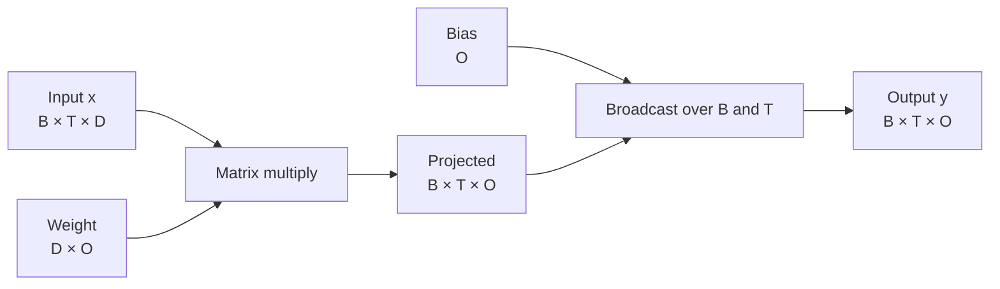

# Lesson 01: Tensors and Shapes

## Learning objectives

Read tensor shapes as meaning; apply batched linear maps, broadcasting, cosine similarity, and feature-wise standardization.

## Prerequisites

Basic Python arithmetic and indexing.

## Mental model

A tensor is both a grid of numbers and a contract about axes. In `(B, T, D)`, `B` separates examples, `T` orders tokens, and `D` stores features. Most LLM operations preserve the first two axes and transform only the last.



**What to notice:** The weight acts on every token independently. Broadcasting reuses one bias vector without copying it into `B × T` separate rows.

## Derivation and algorithm

For one token vector $x$, a linear map is $y=xW+b$. PyTorch extends the same formula to every leading index:

`(B,T,D) @ (D,O) + (O) → (B,T,O)`.

Cosine similarity keeps magnitude out of the comparison:

$$\operatorname{cos}(a,b)=\frac{a\cdot b}{\max(\lVert a\rVert\lVert b\rVert,\epsilon)}.$$

Standardization subtracts the last-axis mean and divides by $\sqrt{\mathrm{variance}+\epsilon}$. Keeping the reduced dimension (`keepdim=True`) makes broadcasting explicit.

## Worked PyTorch example

```python
import torch
from solution import batched_linear, cosine_similarity, standardize

x = torch.tensor([[[1.0, 2.0], [3.0, 4.0]]])  # (1, 2, 2)
weight = torch.tensor([[1.0, 0.0, 1.0], [0.0, 1.0, 1.0]])
bias = torch.tensor([0.5, -0.5, 0.0])
print(batched_linear(x, weight, bias))  # (1, 2, 3)
print(cosine_similarity(torch.tensor([1.0, 0.0]), torch.tensor([1.0, 1.0])))
print(standardize(x))
```

| Operation | Input | Output | Reduced/transformed axis |
|---|---:|---:|---|
| `x @ weight` | `(B,T,D)`, `(D,O)` | `(B,T,O)` | `D` |
| cosine similarity | `(...,D)`, `(...,D)` | `(...)` | `D` |
| standardize | `(...,D)` | `(...,D)` | statistics over `D` |

## Exercise

Implement `cosine_similarity`, `batched_linear`, and `standardize` without Python loops.

```bash
uv run pytest lessons/01_tensors_and_shapes/test_exercise.py
LESSON_IMPL=solution uv run pytest lessons/01_tensors_and_shapes/test_exercise.py
```

## Expected shapes and invariants

Leading dimensions survive a linear map. Identical nonzero vectors have cosine similarity 1. Each standardized row has mean near 0 and variance near 1.

## Common mistakes

- Confusing `W` shaped `(D,O)` with `(O,D)`.
- Reducing over the batch instead of the feature axis.
- Omitting `keepdim=True`, which breaks broadcasting.
- Dividing by zero for a zero-length vector.

## Further experiments

Print each intermediate shape. Try width 1, a zero vector, and a four-dimensional batch. Compare the vectorized result with a loop over tokens.

## Summary

Read tensor shapes as meaning; apply batched linear maps, broadcasting, cosine similarity, and feature-wise standardization. Continue to [Lesson 02](../02_autograd_and_optimization/README.md).
