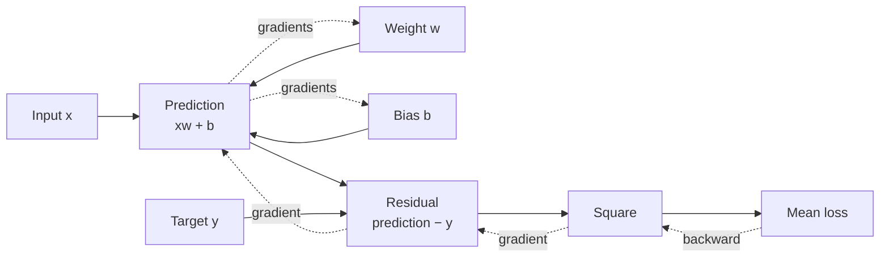

# Lesson 02: Autograd and Optimization

## Learning objectives

Trace a computation graph, compare analytical and finite-difference gradients, and perform a safe gradient-descent update.

## Prerequisites

Lesson 01 and basic derivatives.

## Mental model

A forward pass computes a value. Autograd remembers how that value was built, then a backward pass sends sensitivity from the loss toward every leaf parameter using the chain rule.



**What to notice:** Solid arrows are the forward calculation; dotted arrows are reverse-mode gradients. One scalar loss can produce gradients for millions of parameters.

## Derivation and algorithm

For one example, $\hat y=xw+b$ and $L=(\hat y-y)^2$. The chain rule gives

$$\frac{\partial L}{\partial w}=2(\hat y-y)x,\qquad
\frac{\partial L}{\partial b}=2(\hat y-y).$$

A centered finite difference checks a gradient numerically:

$$f'(w)\approx\frac{f(w+\epsilon)-f(w-\epsilon)}{2\epsilon}.$$

Finite differences are slow but useful for checking a new differentiable operation.

## Worked PyTorch example

```python
import torch
from solution import numerical_gradient, train_step

value = torch.tensor([1.0, -2.0], requires_grad=True)
(value.square().sum()).backward()
print(value.grad)  # [2, -4]
print(numerical_gradient(lambda z: z.square().sum(), value.detach()))

x = torch.arange(4.0).view(-1, 1)
y = 3 * x + 2
weight = torch.zeros(1, 1, requires_grad=True)
bias = torch.zeros(1, requires_grad=True)
print(train_step(x, y, weight, bias, lr=0.01))
```

| Step | Why it exists |
|---|---|
| clear gradients | `.backward()` accumulates into existing `.grad` buffers |
| forward + loss | builds the current computation graph |
| `loss.backward()` | applies the chain rule |
| update under `no_grad` | changes leaves without recording the optimizer itself |

## Exercise

Implement mean-squared error, one gradient-descent step, and a centered numerical gradient.

```bash
uv run pytest lessons/02_autograd_and_optimization/test_exercise.py
LESSON_IMPL=solution uv run pytest lessons/02_autograd_and_optimization/test_exercise.py
```

## Expected shapes and invariants

Analytical and numerical gradients agree within finite-precision tolerance. Repeated updates on the regression data lower loss. Parameters remain leaf tensors.

## Common mistakes

- Forgetting that gradients accumulate.
- Updating parameters while autograd records the update.
- Using an epsilon so tiny that floating-point cancellation dominates.
- Calling `.item()` before `backward`, which disconnects the graph.

## Further experiments

Vary epsilon from `1e-1` to `1e-7` and graph gradient-check error. Change the learning rate until optimization diverges, then explain why.

## Summary

Trace a computation graph, compare analytical and finite-difference gradients, and perform a safe gradient-descent update. Continue to [Lesson 03](../03_neural_networks/README.md).
