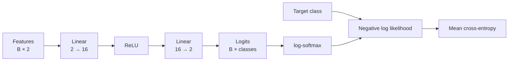

# Lesson 03: Neural Networks

## Learning objectives

Build a two-layer MLP, interpret logits, and optimize cross-entropy on a tiny classification problem.

## Prerequisites

Lessons 01–02.

## Mental model

A linear layer can only tilt and shift a flat decision boundary. A nonlinear activation bends the representation, allowing the second linear layer to separate patterns the first cannot.



**What to notice:** The model returns logits, not probabilities. Cross-entropy uses `log_softmax` internally because the combined operation is more numerically stable.

## Derivation and algorithm

A layer computes $h=xW_1+b_1$, then ReLU applies $\max(0,h)$ elementwise. The final layer produces logits $z$. For target class $y$:

$$L=-\log\frac{e^{z_y}}{\sum_j e^{z_j}}=-\operatorname{logsoftmax}(z)_y.$$

Adding the same constant to every logit does not change probabilities. The differences between logits matter.

## Worked PyTorch example

```python
import torch
from torch.nn import functional as F
from solution import MLP, cross_entropy

model = MLP(input_size=2, hidden_size=4, classes=2)
x = torch.tensor([[1.0, -1.0], [0.5, 2.0]])
target = torch.tensor([0, 1])
logits = model(x)
print(logits.shape)  # (2, 2)
print(F.softmax(logits, dim=-1))  # rows sum to one
print(cross_entropy(logits, target))
```

For logits `[2, 1, 0]` and target class 0:

| Class | Logit | Approx. probability |
|---|---:|---:|
| target 0 | 2 | 0.665 |
| 1 | 1 | 0.245 |
| 2 | 0 | 0.090 |

The loss is `-log(0.665) ≈ 0.408`. Increasing the target logit lowers the loss.

## Exercise

Implement `MLP.forward`, cross-entropy from `log_softmax`, and one optimizer step.

```bash
uv run pytest lessons/03_neural_networks/test_exercise.py
LESSON_IMPL=solution uv run pytest lessons/03_neural_networks/test_exercise.py
```

## Expected shapes and invariants

Logits have shape `(B, classes)`. Cross-entropy matches PyTorch’s stable implementation. Every trainable parameter receives a finite gradient.

## Common mistakes

- Applying softmax in the model and then passing probabilities to cross-entropy.
- Omitting the nonlinearity.
- Indexing each row with the wrong target.
- Updating without `optimizer.zero_grad()`.

## Further experiments

Train with and without ReLU on nonlinear points. Inspect hidden activations and count how many ReLU units are zero. Compare SGD and Adam.

## Summary

Build a two-layer MLP, interpret logits, and optimize cross-entropy on a tiny classification problem. Continue to [Lesson 04](../04_next_token_prediction/README.md).
