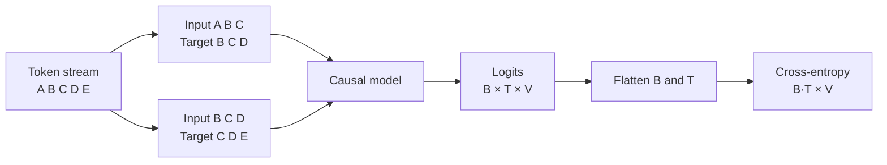

# Lesson 04: Next-Token Prediction

## Learning objectives

Create shifted context-target pairs and compute causal language-model loss over batch and time.

## Prerequisites

Lessons 01–03.

## Mental model

A language model repeats one task at every position: use the visible prefix to predict the next token. A sequence of length `T+1` therefore provides `T` supervised predictions.



**What to notice:** Input and target have equal shape but are shifted by one position. Flattening merges independent prediction positions only at the loss boundary.

## Derivation and algorithm

Given tokens $[t_0,t_1,\ldots,t_T]$, training pairs are
$x=[t_0,\ldots,t_{T-1}]$ and $y=[t_1,\ldots,t_T]$.
The model estimates

$$p(t_1,\ldots,t_T\mid t_0)=\prod_{i=1}^{T}p(t_i\mid t_{<i}).$$

Cross-entropy averages the negative log probability of every correct next token. Causal attention later guarantees position $i$ cannot inspect $t_{i+1}$.

## Worked PyTorch example

```python
import torch
from solution import language_model_loss, make_examples

tokens = torch.tensor([0, 1, 2, 3, 4])
x, y = make_examples(tokens, context_length=3)
print(x)  # [[0,1,2], [1,2,3]]
print(y)  # [[1,2,3], [2,3,4]]

logits = torch.randn(2, 3, 5)  # B=2, T=3, V=5
print(language_model_loss(logits, y))
```

| Window | Visible input | Correct next tokens |
|---:|---|---|
| 0 | `0 1 2` | `1 2 3` |
| 1 | `1 2 3` | `2 3 4` |

At input position 0, target 1 is predicted; at input position 2, target 3 is predicted.

## Exercise

Build all sliding examples, split a token stream in order, and compute language-model cross-entropy.

```bash
uv run pytest lessons/04_next_token_prediction/test_exercise.py
LESSON_IMPL=solution uv run pytest lessons/04_next_token_prediction/test_exercise.py
```

## Expected shapes and invariants

For a stream of length `N`, context `T` creates `N-T` windows. Inputs and targets have identical `(examples,T)` shape. The vocabulary axis remains last.

## Common mistakes

- Using the same tokens as both input and target without shifting.
- Randomly splitting overlapping windows and leaking near-duplicates.
- Flattening the vocabulary axis.
- Letting a causal model see future target tokens.

## Further experiments

Print windows for several context lengths. Compare random and contiguous validation splits. Calculate the loss of uniform logits: it should be `log(V)`.

## Summary

Create shifted context-target pairs and compute causal language-model loss over batch and time. Continue to [Lesson 05](../05_tokenization/README.md).
