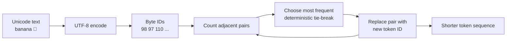

# Lesson 05: Tokenization

## Learning objectives

Encode every Unicode string reversibly as bytes and learn deterministic byte-pair merges.

## Prerequisites

Lesson 04 and familiarity with strings and dictionaries.

## Mental model

A tokenizer is a reversible compression layer between text and model IDs. Bytes guarantee coverage of every UTF-8 string; BPE adds IDs for frequent adjacent patterns so common text uses fewer tokens.



**What to notice:** The base vocabulary covers bytes 0–255. Learned tokens start at 256 and represent byte sequences, so decoding can always expand back to the original bytes.

## Derivation and algorithm

For `banana`, the initial symbols are `[b,a,n,a,n,a]`. Adjacent pair counts are `(a,n):2`, `(n,a):2`, and `(b,a):1`. A deterministic tie rule picks one pair, replaces non-overlapping occurrences, then recounts.

Training and encoding are distinct: training learns an ordered merge list; encoding applies those merges in the same order. This lesson returns the learned token sequence and rules to expose the mechanism.

## Worked PyTorch example

```python
from solution import decode_bytes, encode_bytes, train_bpe

text = "LLM 你好"
ids = encode_bytes(text)
print(ids)
print(decode_bytes(ids) == text)

tokens, rules = train_bpe("banana banana", merges=4)
print(tokens)
print(rules)
```

One possible deterministic progression:

| Round | Most frequent pair | New ID | Sequence effect |
|---:|---|---:|---|
| 0 | `(a,n)` | 256 | `b 256 256 a` for `banana` |
| 1 | `(b,256)` | 257 | common prefix becomes one token |
| 2 | pair recount | 258 | sequence shortens again |

Ties must be resolved consistently or two runs can learn different vocabularies.

## Exercise

Implement byte encode/decode, pair counting, non-overlapping merge application, and BPE training.

```bash
uv run pytest lessons/05_tokenization/test_exercise.py
LESSON_IMPL=solution uv run pytest lessons/05_tokenization/test_exercise.py
```

## Expected shapes and invariants

Byte encode followed by decode exactly reproduces Unicode text. Each accepted merge never increases sequence length. The same corpus and merge count produce identical rules.

## Common mistakes

- Treating Unicode code points as UTF-8 bytes.
- Replacing overlapping pairs twice.
- Counting once instead of recounting after every merge.
- Depending on dictionary iteration for tie-breaking.

## Further experiments

Train on repeated English, Chinese, and emoji text. Compare bytes per token and inspect which patterns become tokens. Try a corpus with tied pair counts.

## Summary

Encode every Unicode string reversibly as bytes and learn deterministic byte-pair merges. Continue to [Lesson 06](../06_embeddings_and_positions/README.md).
