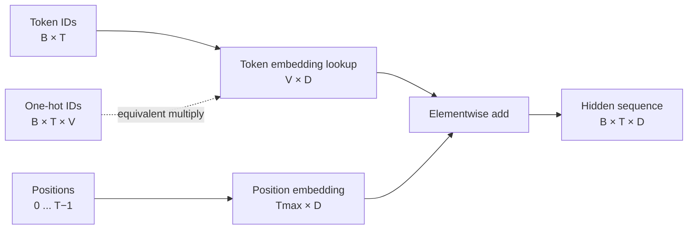

# Lesson 06: Embeddings and Position

## Learning objectives

Relate one-hot multiplication to embedding lookup and combine token identity with sequence position.

## Prerequisites

Lessons 01 and 05.

## Mental model

A token ID names a row in a learned table. That row says what the token means to the model. A separate position vector says where it occurs; adding both preserves shape while mixing content and order.



**What to notice:** A lookup and one-hot matrix multiplication return the same vectors. Lookup avoids constructing a huge mostly-zero `(B,T,V)` tensor.

## Derivation and algorithm

For token ID $i$ and table $E\in\mathbb{R}^{V	imes D}$, one-hot vector $e_i$ selects a row:

$$e_iE=E[i].$$

Without positions, self-attention treats a permutation of tokens like a permutation of outputs. Sinusoidal encodings use pairs
$\sin(p/10000^{2j/D})$ and $\cos(p/10000^{2j/D})$, giving different dimensions different wavelengths.

## Worked PyTorch example

```python
import torch
from torch import nn
from solution import one_hot_lookup, sinusoidal_positions

table = torch.tensor([[1.0, 0.0], [0.0, 1.0], [1.0, 1.0]])
tokens = torch.tensor([[2, 0]])
print(one_hot_lookup(tokens, table))
print(table[tokens])  # exactly equal
print(sinusoidal_positions(length=4, width=6))

embedding = nn.Embedding(3, 2)
print(embedding(tokens).shape)  # (1, 2, 2)
```

| Position | Token vector | Position vector | Sum sent to model |
|---:|---|---|---|
| 0 | `[1.0, 1.0]` | `[0.0, 1.0]` | `[1.0, 2.0]` |
| 1 | `[1.0, 0.0]` | `[0.84, 0.54]` | `[1.84, 0.54]` |

The same token at positions 0 and 1 receives a different final representation.

## Exercise

Implement lookup through one-hot multiplication, sinusoidal positions, and token-plus-learned-position embedding.

```bash
uv run pytest lessons/06_embeddings_and_positions/test_exercise.py
LESSON_IMPL=solution uv run pytest lessons/06_embeddings_and_positions/test_exercise.py
```

## Expected shapes and invariants

Lookup equals one-hot multiplication. Position 0 has sine components 0 and cosine components 1. Addition preserves `(B,T,D)`.

## Common mistakes

- One-hot encoding with the wrong vocabulary size.
- Creating positions on CPU when tokens are elsewhere.
- Concatenating token and position vectors instead of adding them.
- Using integer arithmetic in sine/cosine frequencies.

## Further experiments

Plot each sinusoidal dimension across positions. Swap two tokens with and without position vectors. Compare learned and fixed positions.

## Summary

Relate one-hot multiplication to embedding lookup and combine token identity with sequence position. Continue to [Lesson 07](../07_attention/README.md).
