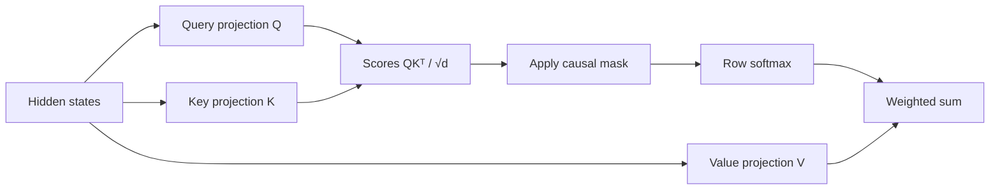

# Lesson 07: Attention

## Learning objectives

Compute scaled dot-product attention, apply a causal mask before softmax, and aggregate values without future-token leakage.

## Prerequisites

Complete Lessons 01–06.

## Mental model

The query asks what the current token needs, keys advertise what each token contains, and values carry the information to mix. The lower-triangular mask removes future keys before probabilities are computed.



**What to notice:** The query asks what the current token needs, keys advertise what each token contains, and values carry the information to mix. The lower-triangular mask removes future keys before probabilities are computed.

## Derivation and algorithm

For one head, `Q` and `K` have shape `(B,T,d)` and scores are `(B,T,T)`. Dividing by `sqrt(d)` prevents dot-product variance from growing with width. Set forbidden scores to negative infinity, then apply softmax row-wise:

`Attention(Q,K,V) = softmax(mask(QKᵀ / sqrt(d))) V`.

For three positions the causal permission matrix is:

| query \ key | 0 | 1 | 2 |
|---:|:---:|:---:|:---:|
| 0 | ✓ | ✗ | ✗ |
| 1 | ✓ | ✓ | ✗ |
| 2 | ✓ | ✓ | ✓ |

Every probability row sums to one over only the visible prefix.

## Worked PyTorch example

```python
import torch
from solution import scaled_dot_product_attention

q = k = torch.tensor([[[1.0, 0.0], [0.0, 1.0], [1.0, 1.0]]])
v = torch.tensor([[[10.0, 0.0], [0.0, 10.0], [5.0, 5.0]]])
output, weights = scaled_dot_product_attention(q, k, v)
print(weights)  # zeros above the diagonal
print(output)
```

## Exercise

Implement `causal_mask` and attention returning both context vectors and interpretable weights.

```bash
uv run pytest lessons/07_attention/test_exercise.py
LESSON_IMPL=solution uv run pytest lessons/07_attention/test_exercise.py
```

## Expected shapes and invariants

Outputs have `(B,T,value_width)`. Weights have `(B,T,T)`, sum to one per query, and are exactly zero above the diagonal.

## Common mistakes

- Masking after softmax
-  scaling by model width rather than head width
-  applying softmax on the query axis
-  building the mask on the wrong device.

## Further experiments

Perturb only the final value and verify earlier outputs are unchanged. Print weights for identity queries and keys.

## Summary

Compute scaled dot-product attention, apply a causal mask before softmax, and aggregate values without future-token leakage. Continue to [Lesson 08](../08_multi_head_attention/README.md).
