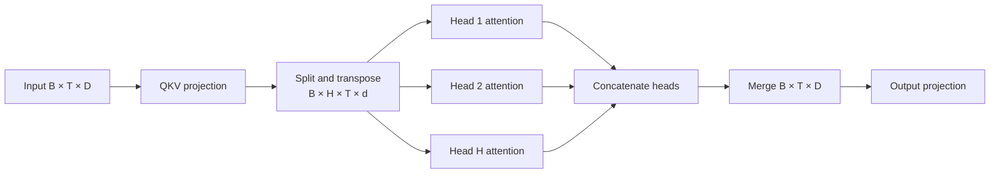

# Lesson 08: Multi-Head Attention

## Learning objectives

Split model width into heads, attend in parallel, merge features, and project the result.

## Prerequisites

Complete Lessons 01–07.

## Mental model

Heads receive different learned Q/K/V projections, so they can represent different relationships. Splitting changes the layout, not the total number of features: `D = H × d`.



**What to notice:** Heads receive different learned Q/K/V projections, so they can represent different relationships. Splitting changes the layout, not the total number of features: `D = H × d`.

## Derivation and algorithm

Starting with `(B,T,D)`, reshape to `(B,T,H,d)`, transpose to `(B,H,T,d)`, attend independently, transpose back, and merge to `(B,T,D)`. The final output projection lets features from different heads interact.

| Stage | Shape |
|---|---|
| input | `(B,T,D)` |
| split heads | `(B,H,T,D/H)` |
| attention scores | `(B,H,T,T)` |
| merge heads | `(B,T,D)` |

After transpose, call `contiguous()` before `view`; otherwise memory order may not match logical axis order.

## Worked PyTorch example

```python
import torch
from solution import MultiHeadAttention, merge_heads, split_heads

x = torch.randn(2, 5, 12)
heads = split_heads(x, heads=3)
print(heads.shape)  # (2, 3, 5, 4)
print(torch.equal(merge_heads(heads), x))
print(MultiHeadAttention(12, 3)(x).shape)
```

## Exercise

Implement reversible head split/merge and causal multi-head self-attention.

```bash
uv run pytest lessons/08_multi_head_attention/test_exercise.py
LESSON_IMPL=solution uv run pytest lessons/08_multi_head_attention/test_exercise.py
```

## Expected shapes and invariants

`D` is divisible by `H`; split followed by merge reproduces the input exactly; changing a future token cannot change an earlier output.

## Common mistakes

- Dividing along the time axis
-  forgetting transpose
-  using noncontiguous `view`
-  omitting the output projection or causal mask.

## Further experiments

Set two heads to controlled projections and inspect whether their attention matrices differ. Try incompatible `D` and `H`.

## Summary

Split model width into heads, attend in parallel, merge features, and project the result. Continue to [Lesson 09](../09_transformer_block/README.md).
