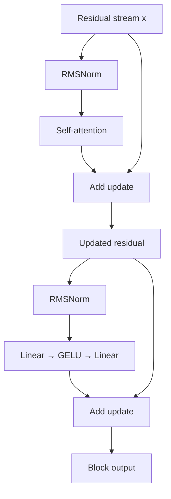

# Lesson 09: Transformer Block

## Learning objectives

Normalize the residual stream and add attention and MLP updates using a pre-norm Transformer block.

## Prerequisites

Complete Lessons 01–08.

## Mental model

Attention and the MLP do not replace the residual stream; each proposes an update. The skip path preserves a direct route for information and gradients through deep stacks.



**What to notice:** Attention and the MLP do not replace the residual stream; each proposes an update. The skip path preserves a direct route for information and gradients through deep stacks.

## Derivation and algorithm

RMSNorm rescales each token vector without subtracting its mean:

`RMSNorm(x) = scale * x / sqrt(mean(x²) + eps)`.

For `x=[3,4]`, RMS is `sqrt((9+16)/2)=sqrt(12.5)`, so the normalized vector is approximately `[0.849,1.131]` and its mean square is 1. A pre-norm block is:

1. `x = x + attention(norm1(x))`
2. `x = x + mlp(norm2(x))`

The MLP expands width to `4D`, applies GELU, and contracts to `D`.

## Worked PyTorch example

```python
import torch
from torch import nn
from solution import RMSNorm, TransformerBlock

x = torch.tensor([[[3.0, 4.0]]])
y = RMSNorm(2)(x)
print(y, y.square().mean(dim=-1))
block = TransformerBlock(2, attention=nn.Linear(2, 2, bias=False))
print(block(x).shape)
```

## Exercise

Implement RMSNorm and both pre-normalized residual updates.

```bash
uv run pytest lessons/09_transformer_block/test_exercise.py
LESSON_IMPL=solution uv run pytest lessons/09_transformer_block/test_exercise.py
```

## Expected shapes and invariants

Input and output are both `(B,T,D)`. Normalized token mean-square is near 1. Gradients remain finite through the skip path.

## Common mistakes

- Subtracting the mean and accidentally implementing LayerNorm
-  normalizing across batch/time
-  replacing rather than adding residuals
-  sharing the two norm modules.

## Further experiments

Zero all sublayer weights—the block should become the identity. Compare RMSNorm with LayerNorm on a vector with nonzero mean.

## Summary

Normalize the residual stream and add attention and MLP updates using a pre-norm Transformer block. Continue to [Lesson 10](../10_tiny_gpt/README.md).
