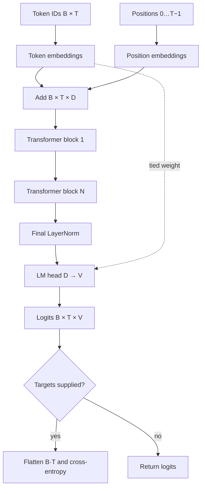

# Lesson 10: Assemble a Tiny GPT

## Learning objectives

Assemble embeddings, causal blocks, final normalization, a tied vocabulary head, and optional next-token loss.

## Prerequisites

Complete Lessons 01–09.

## Mental model

TinyGPT is the previous lessons composed in order. Weight tying makes the input token dictionary and output token classifier share one `(V,D)` parameter matrix.



**What to notice:** TinyGPT is the previous lessons composed in order. Weight tying makes the input token dictionary and output token classifier share one `(V,D)` parameter matrix.

## Derivation and algorithm

For config `V=256, T=32, D=64, H=4, N=2`, token and position embeddings produce `(B,T,64)`. Each block preserves that shape. The head maps every token vector to 256 logits.

| Component | Principal parameter shape |
|---|---|
| token embedding / tied head | `(V,D)` |
| position embedding | `(Tmax,D)` |
| QKV projection per block | `(3D,D)` |
| MLP expansion per block | `(4D,D)` |

The loss reshapes logits to `(B·T,V)` and targets to `(B·T)` only at the boundary. Sequences longer than `context_length` are rejected.

## Worked PyTorch example

```python
import torch
from solution import TinyGPT, TinyGPTConfig, parameter_count

config = TinyGPTConfig(vocab_size=32, context_length=8, d_model=16, n_heads=4, n_layers=2)
model = TinyGPT(config)
tokens = torch.randint(0, 32, (2, 6))
logits, loss = model(tokens, targets=tokens)
print(logits.shape, loss, parameter_count(model))
print(model.lm_head.weight.data_ptr() == model.token_embedding.weight.data_ptr())
```

## Exercise

Assemble the model interface and calculate unique parameter elements.

```bash
uv run pytest lessons/10_tiny_gpt/test_exercise.py
LESSON_IMPL=solution uv run pytest lessons/10_tiny_gpt/test_exercise.py
```

## Expected shapes and invariants

Logits are `(B,T,V)`; loss is scalar when targets exist; the token embedding and head weights have the same storage pointer; no future input affects earlier logits.

## Common mistakes

- Adding position vectors with a batch axis mismatch
-  computing loss over the wrong axis
-  counting tied parameters twice
-  silently truncating overlong inputs.

## Further experiments

Calculate parameters by hand and compare with code. Vary vocabulary and context length separately to see which parameter groups grow.

## Summary

Assemble embeddings, causal blocks, final normalization, a tied vocabulary head, and optional next-token loss. Continue to [Lesson 11](../11_training/README.md).
