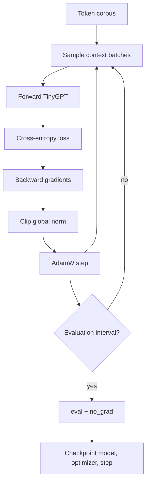

# Lesson 11: Training a Language Model

## Learning objectives

Run deterministic mini-batch training with AdamW, gradient clipping, evaluation mode, and checkpoints.

## Prerequisites

Complete Lessons 01–10.

## Mental model

Training is a feedback loop: predictions produce error, error produces gradients, and the optimizer changes parameters. Evaluation and checkpointing observe the loop without becoming part of it.



**What to notice:** Training is a feedback loop: predictions produce error, error produces gradients, and the optimizer changes parameters. Evaluation and checkpointing observe the loop without becoming part of it.

## Derivation and algorithm

A batch sampler chooses starts and returns `x=t[s:s+T]`, `y=t[s+1:s+T+1]`. An explicit `torch.Generator` makes the sequence reproducible.

Gradient clipping rescales all gradients together when global norm exceeds a limit. If norm is 5 and `max_norm=1`, every gradient is multiplied by `1/5`; direction is preserved while magnitude is bounded.

| Mode | gradients | dropout | parameter update |
|---|---|---|---|
| train | enabled | active | yes |
| evaluation | `no_grad` | disabled | no |

A checkpoint records model state, optimizer state, and step so training can resume rather than merely load weights for inference.

## Worked PyTorch example

```python
import torch
from llm_lessons.data import byte_tokens, make_batches
from llm_lessons.tiny_gpt import TinyGPT, TinyGPTConfig
from solution import evaluate, train_step

model = TinyGPT(TinyGPTConfig(context_length=8, d_model=16, n_heads=2, n_layers=1))
g = torch.Generator().manual_seed(0)
batch = make_batches(byte_tokens(), batch_size=4, context_length=8, generator=g)
optimizer = torch.optim.AdamW(model.parameters(), lr=0.01)
print(evaluate(model, [batch]))
print(train_step(model, *batch, optimizer))
```

## Exercise

Implement one clipped training step and mean evaluation over supplied batches.

```bash
uv run pytest lessons/11_training/test_exercise.py
LESSON_IMPL=solution uv run pytest lessons/11_training/test_exercise.py
```

## Expected shapes and invariants

The optimizer is cleared before backward. Loss and gradients remain finite. Evaluation restores the model’s previous mode. Repeated fitting of one small batch lowers loss.

## Common mistakes

- Forgetting train/eval mode
-  evaluating with gradient tracking
-  clipping parameters instead of gradients
-  resampling when trying to verify overfitting.

## Further experiments

Overfit one batch and plot loss. Save and reload a checkpoint, then compare logits exactly. Try clipping thresholds above and below the observed norm.

## Summary

Run deterministic mini-batch training with AdamW, gradient clipping, evaluation mode, and checkpoints. Continue to [Lesson 12](../12_generation/README.md).
