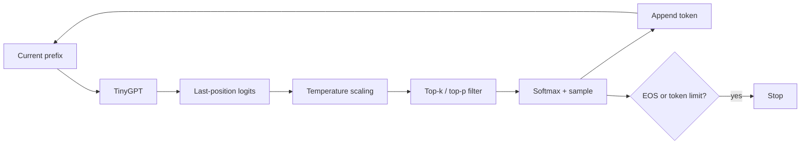

# Lesson 12: Generation and Decoding

## Learning objectives

Convert next-token logits into deterministic or sampled tokens with temperature, top-k, and nucleus filtering.

## Prerequisites

Complete Lessons 01–11.

## Mental model

Generation repeatedly uses only the final logit row. Decoding changes how model probabilities are explored; it does not change the model or add knowledge.



**What to notice:** Generation repeatedly uses only the final logit row. Decoding changes how model probabilities are explored; it does not change the model or add knowledge.

## Derivation and algorithm

Temperature divides logits before softmax. Values below 1 sharpen differences; values above 1 flatten them; temperature 0 is a separate greedy argmax path.

For logits `[4,3,1,0]`:

| Policy | Tokens kept | Behavior |
|---|---|---|
| greedy | only argmax chosen | deterministic |
| top-k=2 | logits 4 and 3 | fixed candidate count |
| top-p≈0.8 | smallest high-probability prefix | adaptive count |
| high temperature | all, flatter probabilities | more randomness |

Top-p sorts probabilities, keeps the first token that crosses the threshold, masks the rest, then probabilities are renormalized by softmax.

## Worked PyTorch example

```python
import torch
from solution import filter_logits, sample_token

logits = torch.tensor([[4.0, 3.0, 1.0, 0.0]])
print(sample_token(logits, temperature=0))
print(filter_logits(logits, top_k=2))
g = torch.Generator().manual_seed(7)
print(sample_token(logits, temperature=0.8, top_p=0.9, generator=g))
```

## Exercise

Implement filtering, explicit-generator sampling, and context-cropped autoregressive generation.

```bash
uv run pytest lessons/12_generation/test_exercise.py
LESSON_IMPL=solution uv run pytest lessons/12_generation/test_exercise.py
```

## Expected shapes and invariants

At least one logit remains finite. Greedy always returns argmax. Equal seeds yield equal samples. Output length grows by exactly the requested count unless an implemented stop condition fires.

## Common mistakes

- Applying temperature after softmax
-  masking all tokens in top-p
-  sampling from unnormalized logits
-  feeding a prefix longer than model context.

## Further experiments

Sample 1000 times under several temperatures and tabulate frequencies. Compare top-k and top-p when the distribution is flat versus peaked.

## Summary

Convert next-token logits into deterministic or sampled tokens with temperature, top-k, and nucleus filtering. Continue to [Lesson 13](../13_kv_cache/README.md).
