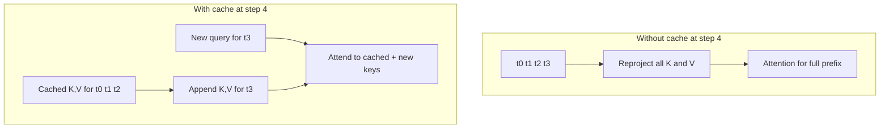

# Lesson 13: KV Caching

## Learning objectives

Cache old attention keys and values so autoregressive decoding processes only each new token.

## Prerequisites

Complete Lessons 01–12.

## Mental model

Old token representations do not change during decoding, so recomputing their K/V projections is wasted work. The cache grows along its time axis while each decode query has length one.



**What to notice:** Old token representations do not change during decoding, so recomputing their K/V projections is wasted work. The cache grows along its time axis while each decode query has length one.

## Derivation and algorithm

A cache per layer has `(B,H,past,d)`. New K/V tensors `(B,H,new,d)` concatenate on axis `-2`. For query index `i` within a chunk and `past_length=P`, visible key indices satisfy `key <= P+i`.

| Decode step | query length | key length after append |
|---:|---:|---:|
| prefill of 3 | 3 | 3 |
| next token | 1 | 4 |
| next token | 1 | 5 |

Cached and uncached outputs must match token by token (within floating-point tolerance). Caching reduces repeated projection/attention work but consumes memory proportional to layers × batch × heads × sequence × head width.

## Worked PyTorch example

```python
import torch
from solution import cached_attention

q, k, v = [torch.randn(1, 2, 4, 8) for _ in range(3)]
full, _ = cached_attention(q, k, v)
cache, pieces = None, []
for i in range(4):
    output, cache = cached_attention(
        q[:, :, i : i + 1], k[:, :, i : i + 1], v[:, :, i : i + 1], cache
    )
    pieces.append(output)
print(torch.allclose(full, torch.cat(pieces, dim=-2)))
```

## Exercise

Implement cache append, an offset causal mask, and cached attention equivalent to full attention.

```bash
uv run pytest lessons/13_kv_cache/test_exercise.py
LESSON_IMPL=solution uv run pytest lessons/13_kv_cache/test_exercise.py
```

## Expected shapes and invariants

Cache time increases monotonically; K and V lengths match; new queries can see all past keys but no future key in a multi-token chunk; cached output matches the full reference.

## Common mistakes

- Concatenating along head width
-  restarting position indices at zero
-  using a standard square mask for offset queries
-  mutating a shared cache unexpectedly.

## Further experiments

Measure projection calls with and without a cache. Test prefill followed by single tokens and by a multi-token chunk. Estimate cache bytes for a larger configuration.

## Summary

Cache old attention keys and values so autoregressive decoding processes only each new token. Continue to [Lesson 14](../14_scaling_and_compute/README.md).
