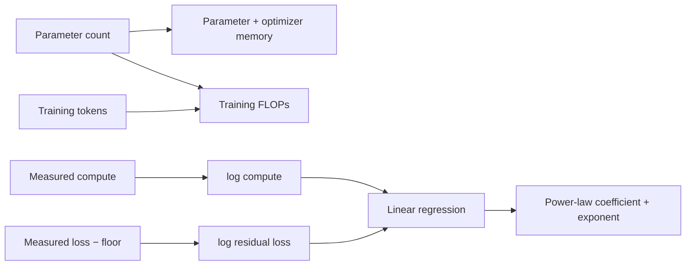
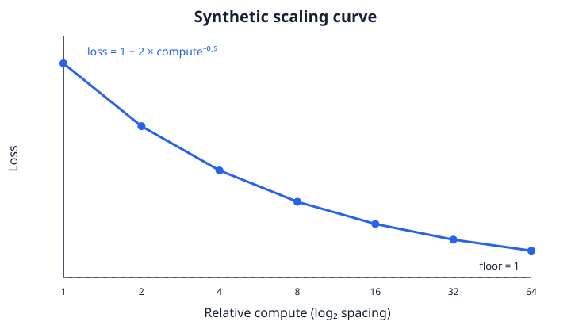

# Lesson 14: Scaling, Data, and Compute

## Learning objectives

Estimate memory and training FLOPs, then interpret a synthetic power-law fit before spending compute.

## Prerequisites

Complete Lessons 01–13.

## Mental model

Scaling is a resource-allocation problem. Parameter count, tokens, numeric precision, and optimizer state jointly determine whether an experiment fits in memory and compute budget.



**What to notice:** Scaling is a resource-allocation problem. Parameter count, tokens, numeric precision, and optimizer state jointly determine whether an experiment fits in memory and compute budget.

## Derivation and algorithm

A useful dense-Transformer estimate is `training FLOPs ≈ 6 × parameters × tokens`. The factor represents forward and backward matrix work; it is a planning approximation, not a profiler.

With 100 million parameters, float32 values, and an educational optimizer multiplier of 4:

| Quantity | Calculation | Result |
|---|---:|---:|
| model/training state | `100M × 4 bytes × 4` | 1.6 GB |
| train on 2B tokens | `6 × 100M × 2B` | `1.2e18` FLOPs |

For `loss = floor + coefficient × compute^exponent`, subtract the known floor and take logs. Linear regression then estimates the coefficient and exponent. The curve is synthetic and teaches fitting mechanics, not a promise about real models.



## Worked PyTorch example

```python
import torch
from solution import fit_power_law, parameter_memory, training_flops

print(parameter_memory(100_000_000) / 1e9)  # GB
print(training_flops(100_000_000, 2_000_000_000))
compute = torch.tensor([1.0, 4.0, 16.0, 64.0])
loss = 1.0 + 2.0 * compute.pow(-0.5)
print(fit_power_law(compute, loss, floor=1.0))
```

## Exercise

Implement resource estimates and log-space power-law fitting.

```bash
uv run pytest lessons/14_scaling_and_compute/test_exercise.py
LESSON_IMPL=solution uv run pytest lessons/14_scaling_and_compute/test_exercise.py
```

## Expected shapes and invariants

Counts are nonnegative integers; doubling tokens doubles the FLOP estimate; the synthetic data recovers coefficient 2 and exponent -0.5.

## Common mistakes

- Treating the 6× rule as exact
-  forgetting optimizer state
-  fitting loss without subtracting its floor
-  extrapolating far beyond measurements.

## Further experiments

Change the floor and inspect fit bias. Estimate TinyGPT memory in float32, float16, and int8. Compare estimates with measured parameter bytes.

## Summary

Estimate memory and training FLOPs, then interpret a synthetic power-law fit before spending compute. Continue to [Lesson 15](../15_fine_tuning_and_lora/README.md).
