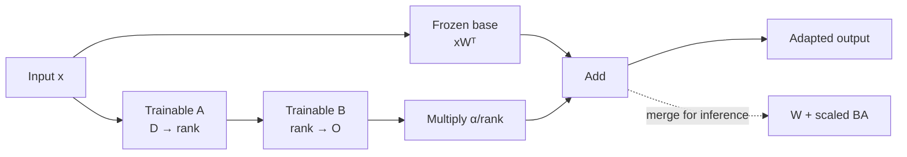

# Lesson 15: Fine-Tuning and LoRA

## Learning objectives

Mask prompt tokens and adapt a frozen linear layer through a trainable low-rank update.

## Prerequisites

Complete Lessons 01–14.

## Mental model

LoRA preserves the pretrained weight and learns a small update in a low-dimensional subspace. Only response tokens contribute to supervised instruction loss.



**What to notice:** LoRA preserves the pretrained weight and learns a small update in a low-dimensional subspace. Only response tokens contribute to supervised instruction loss.

## Derivation and algorithm

For base weight `W` and rank `r`, LoRA computes

`y = xWᵀ + (alpha/r) xAᵀBᵀ`.

Equivalently, merge `W_merged = W + (alpha/r) BA`. If `W` is `O×D`, full tuning changes `O×D` values while LoRA trains `r×D + O×r`.

| token | prompt/response | target included? |
|---|---|:---:|
| `Question:` | prompt | no (`-100`) |
| `2+2?` | prompt | no (`-100`) |
| `4` | response | yes |
| `<eos>` | response | yes |

Initializing `B` to zero makes the adapter initially produce exactly the base model output.

## Worked PyTorch example

```python
import torch
from torch import nn
from solution import LoRALinear

base = nn.Linear(8, 6)
lora = LoRALinear(base, rank=2, alpha=4)
x = torch.randn(3, 8)
print(lora(x).shape)
print(base.weight.requires_grad)  # False
lora.b.data.normal_()
merged = torch.nn.functional.linear(x, lora.merged_weight(), base.bias)
print(torch.allclose(lora(x), merged, atol=1e-6))
```

## Exercise

Implement response-only cross-entropy and a mergeable LoRA linear layer.

```bash
uv run pytest lessons/15_fine_tuning_and_lora/test_exercise.py
LESSON_IMPL=solution uv run pytest lessons/15_fine_tuning_and_lora/test_exercise.py
```

## Expected shapes and invariants

Base parameters remain frozen; adapter shapes are `(r,D)` and `(O,r)`; zero-initialized B preserves base output; merged and unmerged outputs agree.

## Common mistakes

- Masking response rather than prompt tokens
-  training the frozen base accidentally
-  multiplying A and B in the wrong order
-  forgetting alpha/rank scaling.

## Further experiments

Compare parameter counts at ranks 1, 2, 4, and full rank. Optimize the adapter on a tiny mapping, then merge and verify output equality.

## Summary

Mask prompt tokens and adapt a frozen linear layer through a trainable low-rank update. Continue to [Lesson 16](../16_evaluation/README.md).
