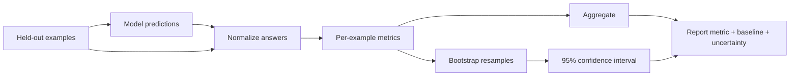
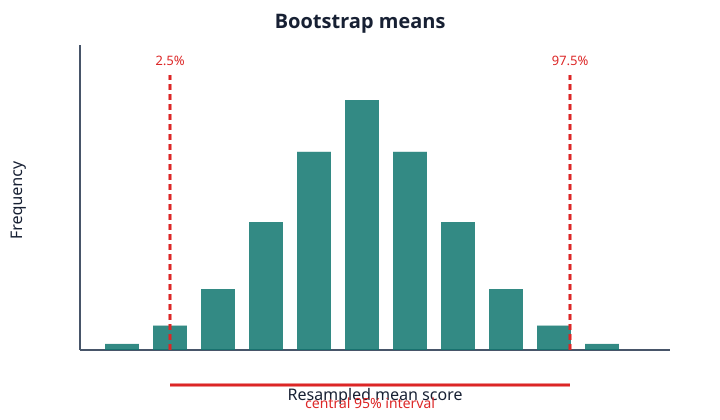

# Lesson 16: Evaluation

## Learning objectives

Measure normalized exact behavior, token F1, corpus perplexity, and bootstrap uncertainty on held-out data.

## Prerequisites

Complete Lessons 01–15.

## Mental model

Evaluation is a measurement system, not one number. The dataset, normalization, aggregation weights, baseline, and uncertainty all shape the conclusion.



**What to notice:** Evaluation is a measurement system, not one number. The dataset, normalization, aggregation weights, baseline, and uncertainty all shape the conclusion.

## Derivation and algorithm

Normalization lowercases, removes punctuation, and collapses whitespace. For prediction `a b` and reference `a c`, one token overlaps: precision and recall are both `1/2`, so F1 is `0.5`.

Corpus perplexity weights losses by token counts:

`PPL = exp(sum(loss_i × tokens_i) / sum(tokens_i))`.

A simple mean of batch losses is wrong when batches contain different token counts. Bootstrap intervals repeatedly sample example scores with replacement and take quantiles of their means.

| Example scores | Resample | Mean |
|---|---|---:|
| `[0,1,1,1]` | `[1,1,0,1]` | 0.75 |
| `[0,1,1,1]` | `[0,0,1,1]` | 0.50 |



## Worked PyTorch example

```python
import torch
from solution import bootstrap_interval, normalize_answer, perplexity, token_f1

print(normalize_answer(" Hello, WORLD! "))
print(token_f1("a b", "a c"))
print(perplexity(torch.tensor([1.0, 2.0]), torch.tensor([1.0, 3.0])))
print(bootstrap_interval(torch.tensor([0.0, 1.0, 1.0, 1.0]), samples=1000))
```

## Exercise

Implement normalization, token F1, weighted perplexity, and a seeded bootstrap interval.

```bash
uv run pytest lessons/16_evaluation/test_exercise.py
LESSON_IMPL=solution uv run pytest lessons/16_evaluation/test_exercise.py
```

## Expected shapes and invariants

Normalized comparison is deterministic; F1 lies in `[0,1]`; perplexity is positive; fixed seeds reproduce interval endpoints.

## Common mistakes

- Evaluating on training data
-  averaging batch perplexities
-  hiding normalization rules
-  interpreting overlapping intervals as a complete significance test.

## Further experiments

Compare a constant baseline and TinyGPT. Change sample size and observe interval width. Design an adversarial example for exact match versus token F1.

## Summary

Measure normalized exact behavior, token F1, corpus perplexity, and bootstrap uncertainty on held-out data. Continue to [Lesson 17](../17_alignment/README.md).
