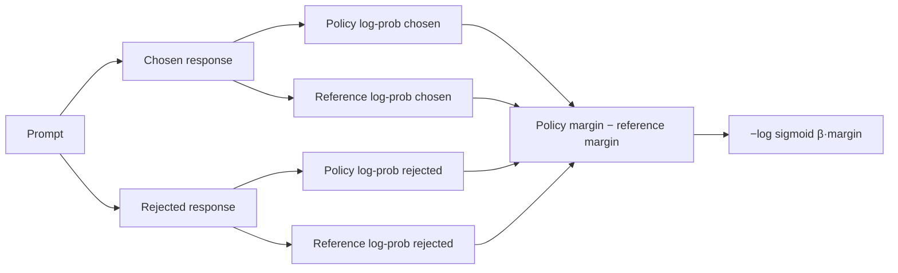

# Lesson 17: Alignment Fundamentals

## Learning objectives

Compute stable pairwise preference and educational DPO losses from chosen and rejected responses.

## Prerequisites

Complete Lessons 01–16.

## Mental model

Preference training asks for a relative ordering, not an absolute answer score. DPO rewards the policy for preferring chosen responses more strongly than a fixed reference does.



**What to notice:** Preference training asks for a relative ordering, not an absolute answer score. DPO rewards the policy for preferring chosen responses more strongly than a fixed reference does.

## Derivation and algorithm

Pairwise reward loss is `-logsigmoid(reward_chosen - reward_rejected)`. DPO forms

`margin = (policy_chosen - policy_rejected) - (reference_chosen - reference_rejected)`

and minimizes `-logsigmoid(beta × margin)`.

| DPO margin | Interpretation | Loss trend |
|---:|---|---|
| positive | policy favors chosen more than reference | below `log(2)` |
| zero | same preference as reference | `log(2)` |
| negative | policy favors chosen less | above `log(2)` |

`logsigmoid` stays finite for extreme margins. `beta` controls how strongly the objective responds to deviation from the reference.

## Worked PyTorch example

```python
import torch
from solution import dpo_loss, pairwise_preference_loss

print(pairwise_preference_loss(torch.tensor([2.0]), torch.tensor([-1.0])))
print(
    dpo_loss(
        policy_chosen=torch.tensor([1.0]),
        policy_rejected=torch.tensor([0.0]),
        reference_chosen=torch.tensor([1.0]),
        reference_rejected=torch.tensor([0.0]),
    )
)  # log(2)
```

## Exercise

Implement stable pairwise logistic loss and the toy DPO objective.

```bash
uv run pytest lessons/17_alignment/test_exercise.py
LESSON_IMPL=solution uv run pytest lessons/17_alignment/test_exercise.py
```

## Expected shapes and invariants

Swapping chosen/rejected reverses the margin; equal policy and reference margins produce `log(2)`; extreme inputs remain finite.

## Common mistakes

- Using raw probabilities instead of sequence log-probabilities
-  reversing chosen and rejected
-  updating the reference
-  presenting this toy objective as a complete alignment system.

## Further experiments

Sweep margin and beta, then plot loss. Construct examples where policy and reference both favor chosen but by different amounts.

## Summary

Compute stable pairwise preference and educational DPO losses from chosen and rejected responses. Continue to [Lesson 18](../18_inference/README.md).
