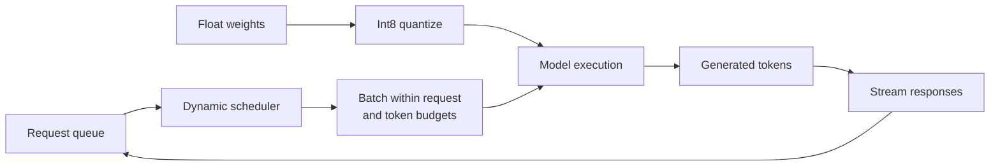

# Lesson 18: Inference and Serving Constraints

## Learning objectives

Quantize weights, account for storage, and pack requests into dynamic batches under latency and token budgets.

## Prerequisites

Complete Lessons 01–17.

## Mental model

Serving balances competing objectives. Larger batches improve hardware utilization but can delay individual requests; quantization lowers memory and bandwidth but introduces reconstruction error.



**What to notice:** Serving balances competing objectives. Larger batches improve hardware utilization but can delay individual requests; quantization lowers memory and bandwidth but introduces reconstruction error.

## Derivation and algorithm

Symmetric int8 quantization chooses `scale = max(abs(W))/127`, stores `q = round(W/scale)` in `[-127,127]`, and reconstructs `q × scale`.

For weights `[-1.0, 0.5, 1.0]`, scale is about `0.00787`, integers are `[-127,64,127]`, and reconstructed 0.5 is about 0.504. One float32 scale plus one byte per weight is far smaller than four bytes per weight for large tensors.

Dynamic batching greedily adds requests while both constraints hold:

| lengths | max requests | max tokens | batches of indices |
|---|---:|---:|---|
| `[3,5,4,8]` | 2 | 9 | `[0,1]`, `[2]`, `[3]` |

Real schedulers also consider arrival times, padding, priorities, prefill versus decode, and KV-cache capacity.

## Worked PyTorch example

```python
import torch
from solution import dequantize_int8, dynamic_batches, quantize_int8, storage_bytes

weight = torch.tensor([-1.0, 0.5, 1.0])
values, scale = quantize_int8(weight)
print(values, scale, dequantize_int8(values, scale))
print(storage_bytes(values, scale))
print(dynamic_batches([3, 5, 4, 8], max_requests=2, max_tokens=9))
```

## Exercise

Implement int8 quantize/dequantize, exact storage accounting, and deterministic dynamic batching.

```bash
uv run pytest lessons/18_inference/test_exercise.py
LESSON_IMPL=solution uv run pytest lessons/18_inference/test_exercise.py
```

## Expected shapes and invariants

Quantized values are int8 and bounded; maximum reconstruction error is roughly half a scale; every request appears once and no batch exceeds either budget.

## Common mistakes

- Using an asymmetric formula with symmetric tests
-  allowing `-128` accidentally
-  forgetting scale storage
-  batching a request larger than the token budget.

## Further experiments

Quantize each row separately and compare error/storage. Simulate arrivals and measure waiting time versus throughput under several batch budgets.

## Summary

Quantize weights, account for storage, and pack requests into dynamic batches under latency and token budgets. You have completed the core curriculum.
